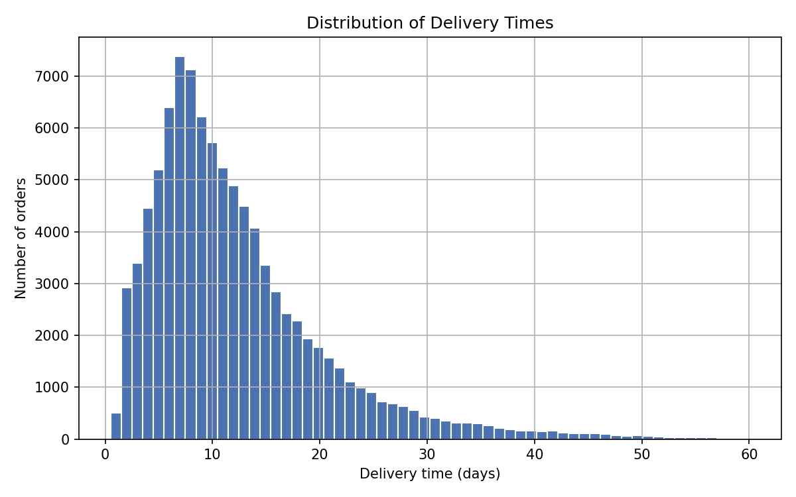
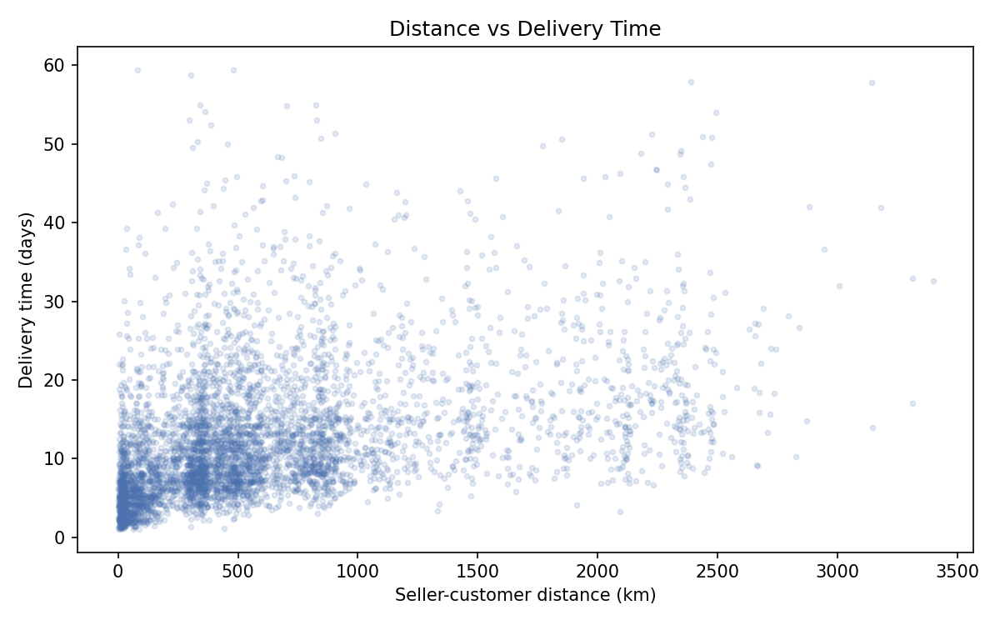

# 📦 Delivery Time Prediction

Machine learning system that predicts **how many days an e-commerce order will take to arrive**, trained on 90k+ real orders from the [Olist Brazilian E-Commerce dataset](https://www.kaggle.com/datasets/olistbr/brazilian-ecommerce).

Running my own e-commerce store made me realize how much delivery time uncertainty affects customer satisfaction — so I built a model that predicts it from order details like seller-customer distance, product size, and freight cost.

## Demo

<!-- Add your Streamlit Cloud link here after deploying -->
Interactive Streamlit app where you enter order details and get a predicted delivery time:

```
streamlit run app/streamlit_app.py
```

<!-- Add a screenshot:  -->

## Results

| Model | MAE (days) | RMSE | R² |
|---|---|---|---|
| Naive (mean) baseline | – | – | 0.00 |
| Linear Regression | – | – | – |
| **XGBoost** | – | – | – |

<!-- Fill this table with your actual numbers from models/metrics.json after training -->

Key findings from EDA:
- Seller-customer **distance** is the strongest predictor of delivery time
- Cross-state deliveries take significantly longer than same-state ones
- Northern states experience the slowest average delivery times




## Features used

| Feature | Description |
|---|---|
| `distance_km` | Haversine distance between seller and customer zip centroids |
| `same_state` | Whether seller and customer are in the same state |
| `freight_value`, `price`, `n_items` | Order economics |
| `product_weight_g`, `volume_cm3` | Package size |
| `estimated_days` | Platform's own promised estimate |
| `purchase_weekday/hour/month`, `is_weekend` | Temporal effects |
| `customer_state` | One-hot encoded destination state |

## Project structure

```
├── app/
│   └── streamlit_app.py    # Interactive prediction UI
├── src/
│   ├── prepare_data.py     # Merge raw Olist CSVs + feature engineering
│   ├── eda.py              # Exploratory analysis figures
│   └── train.py            # Model training + evaluation
├── data/                   # Dataset (see data/README.md)
├── models/                 # Trained model + metrics
└── reports/figures/        # EDA visualizations
```

## Setup

```bash
git clone https://github.com/<your-username>/delivery-time-prediction.git
cd delivery-time-prediction
pip install -r requirements.txt
```

Download the [Olist dataset](https://www.kaggle.com/datasets/olistbr/brazilian-ecommerce) and extract the CSVs into `data/raw/`, then:

```bash
python src/prepare_data.py   # build data/processed.csv
python src/eda.py            # generate figures
python src/train.py          # train + evaluate models
streamlit run app/streamlit_app.py
```

## Tech stack

Python · pandas · scikit-learn · XGBoost · Streamlit · matplotlib
